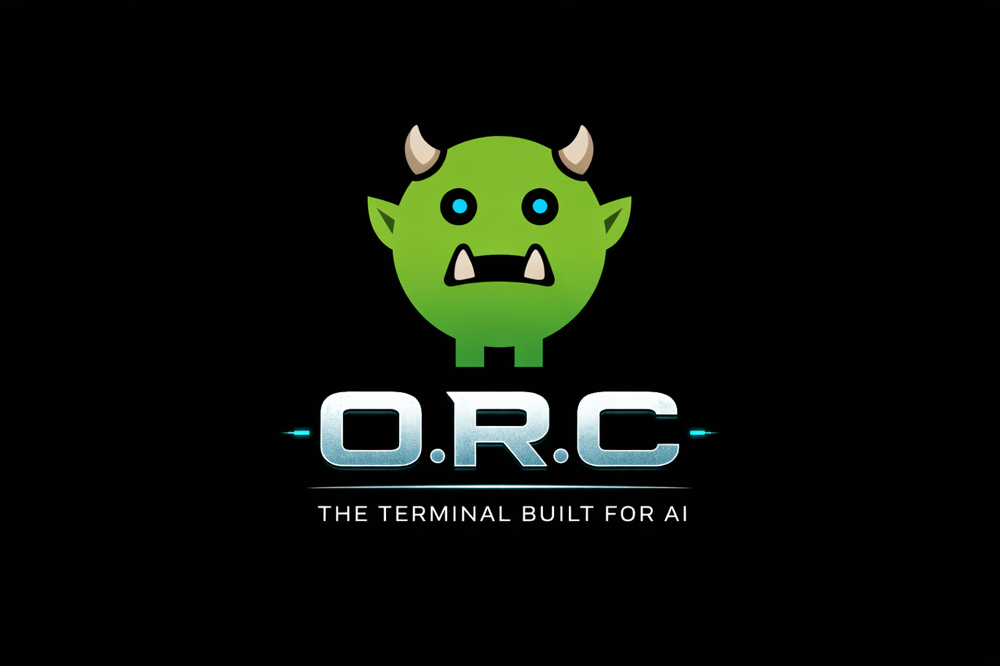

# O.R.C. Terminal

<p align="center">
  
</p>

<p align="center"><strong>The terminal built for AI.</strong></p>

O.R.C. Terminal is a Windows-first desktop app for supervising terminal access and brokered AI agent execution through a local policy layer.

It combines:

- A Tauri desktop shell
- A React dashboard
- A PTY-backed PowerShell session
- Approval queues for commands, network requests, and other risky actions
- Agent supervision for OpenClaw / NemoClaw-style workers
- An in-memory audit trail with export support

## Status

This repository is an MVP. It is usable for local development and demos, but a few integrations are still intentionally incomplete.

It is best shared today as a Windows-first open-source MVP rather than a polished cross-platform release.

Current limitations:

- Terminal input is sent through the app command box instead of full raw keystroke interception
- MCP transport wiring is modeled in the backend, but not fully implemented yet
- Audit persistence is export-based and currently stored in memory during a session
- OpenClaw / NemoClaw integrations expect locally available executables or adapters

## Prerequisites

This project is built and tested as a Windows desktop app.

Install these before running it:

- Node.js 20+ and npm
- Rust 1.77+ with Cargo
- Microsoft C++ Build Tools for Rust/Tauri builds
- WebView2 Runtime
- Tauri CLI

Install the Tauri CLI globally if you do not already have it:

```powershell
cargo install tauri-cli --version "^1.5"
```

Optional tools for the sample adapters:

- Python 3.10+ for [`scripts/mock_claw_adapter.py`](/C:/Users/Rontastic/Desktop/New%20folder/scripts/mock_claw_adapter.py)
- Node.js 22+ recommended for [`scripts/openclaw_gateway_adapter.mjs`](/C:/Users/Rontastic/Desktop/New%20folder/scripts/openclaw_gateway_adapter.mjs), which relies on the modern global `WebSocket`

## Quick Start

Clone the repository, install JavaScript dependencies, and launch the desktop app:

```powershell
npm install
npm run tauri:dev
```

That command starts the Vite dev server and the Tauri shell together.

## Available Scripts

```powershell
npm run dev
```

Starts only the Vite frontend on `http://localhost:1420`.

```powershell
npm run tauri:dev
```

Starts the full desktop app in development mode.

```powershell
npm run build
```

Builds the frontend assets into `dist/`.

```powershell
npm run tauri:build
```

Builds a desktop bundle through Tauri.

## First Run Walkthrough

1. Start the app with `npm run tauri:dev`.
2. Open the default terminal session in the dashboard.
3. Send a simple command like `pwd` or `dir` from the command input.
4. Review the `Policy`, `Approvals`, and `Audit` views to understand how requests are surfaced.
5. Optionally create an agent in the `Agents` view to test supervised worker execution.

## Running a Sample Agent

For a quick local smoke test, you can use the bundled mock adapter:

```powershell
python scripts/mock_claw_adapter.py
```

In the app:

1. Open the `Agents` view.
2. Create an `OpenClaw` or `NemoClaw` worker.
3. Set the executable path to your Python interpreter.
4. Set the args to `scripts/mock_claw_adapter.py`.
5. Assign a simple task and approve the resulting brokered request when prompted.

The mock adapter emits a sample `PROXY_CMD git status` request so you can validate the approval flow end to end.

## Working OpenClaw Setup

This repo includes a working broker-only OpenClaw adapter at [`scripts/openclaw_gateway_adapter.mjs`](/C:/Users/Rontastic/Desktop/New%20folder/scripts/openclaw_gateway_adapter.mjs).

The exact setup validated in this repository is:

1. Install OpenClaw globally.
2. Run OpenClaw onboarding.
3. Start the OpenClaw gateway locally.
4. Create an `OpenClaw` worker in O.R.C. that launches `node.exe` directly and passes the adapter script as the first argument.

### 1. Install OpenClaw

```powershell
npm install -g openclaw
```

If `openclaw` is not added to your current `PATH`, use the generated PowerShell shim directly:

```powershell
& "C:\Users\YOUR_USERNAME\AppData\Roaming\npm\openclaw.ps1" --help
```

### 2. Run OpenClaw Onboarding

Run:

```powershell
& "C:\Users\YOUR_USERNAME\AppData\Roaming\npm\openclaw.ps1" onboard --mode local
```

Recommended choices during setup:

- Security acknowledgement: `Yes`
- Setup mode: `QuickStart`
- Existing config detected: `Reset`
- Reset scope: `Config + creds + sessions`
- Channel: choose the simplest path you want for local testing
- Web search: `Skip for now`
- Configure skills now: `No`
- Hooks: `Skip for now`
- Gateway service already installed: `Restart`

Important:

- OpenClaw onboarding may set `gateway.controlUi.allowInsecureAuth` to `true`.
- O.R.C. now hardens this automatically on app bootstrap and again when an OpenClaw worker launches, but it is still worth verifying after any manual OpenClaw onboarding or gateway restart you run outside O.R.C.

Check the gateway section of your config:

```powershell
Get-Content C:\Users\YOUR_USERNAME\.openclaw\openclaw.json | Select-String -Pattern "allowInsecureAuth|token|controlUi|gateway" -Context 1,1
```

If onboarding enabled insecure auth, disable it:

```powershell
(Get-Content C:\Users\YOUR_USERNAME\.openclaw\openclaw.json -Raw) -replace '"allowInsecureAuth"\s*:\s*true','"allowInsecureAuth": false' | Set-Content C:\Users\YOUR_USERNAME\.openclaw\openclaw.json
```

### 3. Verify Gateway Health

Check that the gateway is healthy before creating an O.R.C. worker:

```powershell
& "C:\Users\YOUR_USERNAME\AppData\Roaming\npm\openclaw.ps1" gateway status --json
```

The validated local setup in this repo used:

- Gateway URL: `ws://127.0.0.1:18789`
- Control UI auth mode: token
- Local bind: loopback only

### 4. Create the OpenClaw Worker in O.R.C.

In the `Agents` view, create a new `OpenClaw` worker with these values:

- Executable path:

```text
C:\Program Files\nodejs\node.exe
```

- Args:

```text
"C:\Users\YOUR_USERNAME\path\to\repo\scripts\openclaw_gateway_adapter.mjs" --gateway-url ws://127.0.0.1:18789 --gateway-token YOUR_GATEWAY_TOKEN
```

- Memory mode: `Ephemeral memory`
- Profile: `Strict Broker-Only`

Important:

- Do not point O.R.C. directly at `openclaw.ps1` or `openclaw.mjs` for the worker runtime.
- Launching the adapter through `node.exe` is the working path validated here.
- Quote the adapter script path if your repo path contains spaces.

To retrieve the current gateway token from your local OpenClaw config:

```powershell
Get-Content C:\Users\YOUR_USERNAME\.openclaw\openclaw.json | Select-String -Pattern '"token"'
```

### 5. Smoke Test the Adapter

After starting the worker, the output should include lines similar to:

- `adapter-status: OpenClaw Gateway adapter ready`
- `adapter-status: target agent main via ws://127.0.0.1:18789`
- `adapter-status: broker-only mode enabled; emit PROXY_CMD/PROXY_JSON through the model`

If you see those lines, the adapter is alive and the gateway handshake is working.

### 6. Read-Only Task Test

Assign this task in `Tasks`:

- Title: `Inspect workspace`
- Summary:

```text
List the files in the current workspace and report back. Do not modify anything.
```

Guardrails:

- Shell: enabled
- Network: disabled
- Writes: disabled

Expected result:

- The task may complete without shell execution if the model can answer directly.
- A successful completion proves the adapter can receive tasks and return final answers through O.R.C.

### 7. Brokered Command Test

Assign this task in `Tasks`:

- Title: `Check working directory`
- Summary:

```text
Use one shell command to print the current working directory, then report the result. Do not modify anything.
```

Guardrails:

- Shell: enabled
- Network: disabled
- Writes: disabled

Expected result:

1. The agent emits `PROXY_CMD pwd` or an equivalent brokered command.
2. O.R.C. runs the command through the terminal broker.
3. The result is returned to the adapter.
4. The final answer is reported back to the user.

The validated successful output in this repo included:

- `adapter-status: agent accepted task run ...`
- `[proxy] allowed worker command \`pwd\``
- `adapter-status: received broker result ... (completed)`
- `The current working directory is: C:\Users\...\New folder`

### 8. Supported Adapter Environment Variables

The adapter also supports these environment variables:

- `OPENCLAW_GATEWAY_URL`
- `OPENCLAW_GATEWAY_TOKEN`
- `OPENCLAW_GATEWAY_TOKEN_FILE`
- `OPENCLAW_AGENT_ID`
- `OPENCLAW_DEVICE_IDENTITY_FILE`
- `ORC_TERMINAL_SANDBOX_ROOT`

### 9. Security Notes

- Treat the gateway token as sensitive.
- Rotate the token after sharing logs or screenshots.
- Keep `gateway.controlUi.allowInsecureAuth` set to `false` unless you explicitly need a weaker local-development setup. O.R.C. will try to force it back to `false` automatically during bootstrap and OpenClaw worker startup.
- The adapter stores a persistent device identity so repeat runs look like the same operator device to the gateway.

## Project Structure

- [`src/`](/C:/Users/Rontastic/Desktop/New%20folder/src) - React UI for the dashboard, terminal, approvals, profiles, tasks, protections, and audit views
- [`src-tauri/src/main.rs`](/C:/Users/Rontastic/Desktop/New%20folder/src-tauri/src/main.rs) - Tauri entry point and command registration
- [`src-tauri/src/app_state.rs`](/C:/Users/Rontastic/Desktop/New%20folder/src-tauri/src/app_state.rs) - in-memory application state and orchestration logic
- [`src-tauri/src/policy.rs`](/C:/Users/Rontastic/Desktop/New%20folder/src-tauri/src/policy.rs) - policy evaluation and scope handling
- [`src-tauri/src/agent.rs`](/C:/Users/Rontastic/Desktop/New%20folder/src-tauri/src/agent.rs) - supervised worker integration

## Troubleshooting

- If `npm run tauri:dev` fails because `tauri` is not found, install the Tauri CLI with Cargo.
- If the desktop shell opens a blank window, make sure the Vite dev server is running on port `1420`.
- If Rust compilation fails on Windows, verify the MSVC build tools and WebView2 runtime are installed.
- If an agent appears stalled, check the `Approvals` view before assuming the worker is broken.
- If the OpenClaw adapter fails immediately, verify the gateway URL, token, and local Node version.

## Known Issues

- OpenClaw QuickStart onboarding may re-enable `gateway.controlUi.allowInsecureAuth` even after you have turned it off manually. O.R.C. now auto-hardens that flag back to `false` during bootstrap and OpenClaw worker launch, but if you are running OpenClaw outside O.R.C. you should still re-check `C:\Users\YOUR_USERNAME\.openclaw\openclaw.json` after onboarding or gateway restarts.
- On Windows, `openclaw` may install correctly but not be available in the current PowerShell session `PATH` until you open a new shell. Using `C:\Users\YOUR_USERNAME\AppData\Roaming\npm\openclaw.ps1` directly is a reliable fallback.
- O.R.C. workers should not launch `openclaw.ps1` or `openclaw.mjs` directly. The validated working path is `node.exe` plus [`scripts/openclaw_gateway_adapter.mjs`](/C:/Users/Rontastic/Desktop/New%20folder/scripts/openclaw_gateway_adapter.mjs).
- If your repository path contains spaces, quote the adapter script path in the worker args or Node will fail to resolve the script.
- The adapter stores a persistent OpenClaw device identity. If onboarding starts behaving inconsistently again, clear the adapter device-identity file and retry with a fresh agent.

## Open Source Notes

Before publishing, you may also want to add:

- A root `LICENSE` file if you want GitHub to detect the project license automatically
- Screenshots or a short demo GIF for the repository page
- A `CONTRIBUTING.md` if you expect outside contributions

## License

MIT. See [`LICENSE`](/C:/Users/Rontastic/Desktop/New%20folder/LICENSE).
